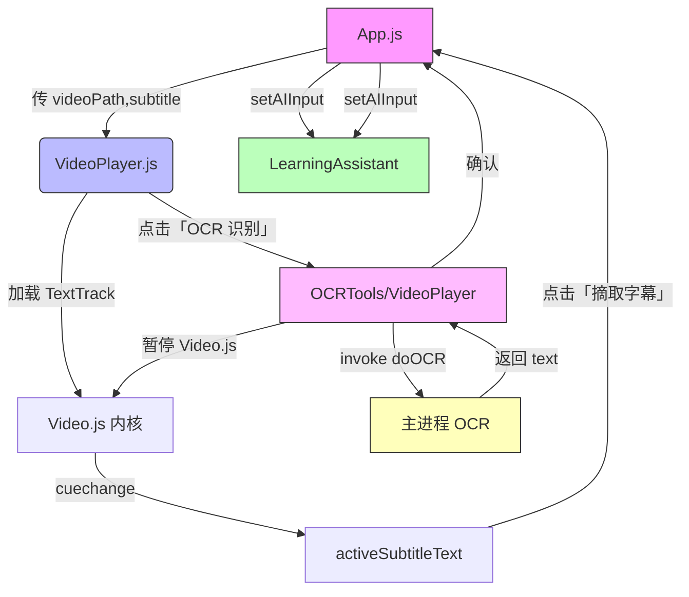

下面给出整体功能设计思路、模块划分及流程图，后续可据此在相应文件中打点改造。

---  
## 一、功能总体思路  

1. 外挂字幕模式  
   - Video.js 直接加载 `.vtt`/`.srt` 字幕轨道，内部会根据播放时间自动显示字幕。  
   - 用户点击「摘取当前字幕」按钮，即把当前活动的 subtitle cue 文本传给 AI 助手。  

2. OCR 模式  
   - 当没有外挂字幕时，展示「OCR 识别」按钮。  
   - 点击时暂停视频，截取当前帧或直接调用主进程 OCR 接口，得到文字后弹窗预览。  
   - 用户确认后，再把识别文字传给 AI 助手输入框。  

3. 性能考量  
   - 全部与 Video.js 的 TextTrack、cuechange 事件集成，避免每帧轮询。  
   - OCR 仅在用户点击时触发，不做实时流式识别。  
   - 所有耗时操作（帧抓取、OCR）均在主进程中或异步执行，渲染层只做最小状态更新。  

4. AI 助手交互  
   - `App.js` 提供 `onSubtitleSelect(text)` 回调，将文本传给 `LearningAssistant` 的输入框并自动发起查询。  

---  
## 二、模块划分与对应文件  

```text
App.js
 ├─ 全局状态：videoData、subtitles、有无外挂字幕 flag
 ├─ 回调：handleSubtitleSelect(text) → setAIInput(text)
 ├─ OCR 回调：handleOCR() → window.electronAPI.doOCR(...)
 └─ 渲染
VideoPlayer.js
 ├─ 初始化 Video.js 播放器 & 加载字幕轨道
 ├─ 监听 textTrack.cuechange 更新 activeSubtitleText
 ├─ 外挂字幕按钮：摘取 → 调用 props.onSubtitleSelect(activeSubtitleText)
 ├─ OCR 按钮：暂停、调用 props.onOCR、显示弹窗
 └─ 性能：只在轨道变化或按钮事件时更新状态
OCRTools（可选或合并到 VideoPlayer）
 └─ 只负责触发 OCR，展示 loading／结果确认
LearningAssistant.js
 └─ 输入框：接受外部传入的 `selectedText`，并在确认时调用 API
preload.js
 └─ contextBridge.exposeInMainWorld('electronAPI', { doOCR: invoke('doOCR', …) })
index.js (主进程)
 └─ ipcMain.handle('doOCR', async ({ videoPath, currentTime }) ⇒ 抓帧+识别）
```

---  
## 三、流程图（Mermaid）  



- 节点说明  
  - A：全局控制层，管理状态和回调  
  - B：VideoPlayer 组件，基于 Video.js 加载/显示字幕并提供按钮  
  - D：OCR 触发点，可独立模块也可合并到 VideoPlayer  
  - E：主进程 OCR 服务，实际运行 tesseract.js 或 API  

---  
## 四、后续改造要点  

1. **VideoPlayer.js**  
   - 初始化 `player.textTracks()`，找到启用的字幕轨道并监听 `cuechange`。  
   - 在播放器上方或控制栏中插入两按钮：  
     - 「摘取当前字幕」：内部直接调用 `props.onSubtitleSelect(activeSubtitleText)`  
     - 「OCR 识别」（仅无外挂字幕时启用）：先 `player.pause()`，再调用 `props.onOCR({ videoPath, currentTime })`，在回调里弹窗确认。  

2. **App.js**  
   - 新增状态 `hasExternalSubtitles`（可由字幕列表长度决定）  
   - 实现 `handleOCR` 调用 `window.electronAPI.doOCR({ videoPath, currentTime })` 并在结果确认后调用 `onSubtitleSelect`  
   - 通过 `<LearningAssistant selectedText={aiInput} />` 把摘取或 OCR 文本填进输入框  

3. **主进程 & preload**  
   - `ipcMain.handle('doOCR', ...)`：接收 `{ videoPath, currentTime }`，用 ffmpeg/tesseract.js 或 API 从视频帧识别文字。  
   - `preload.js` 暴露 `doOCR` 给渲染进程。  

4. **性能优化**  
   - 只在按钮点击时触发 OCR，不做循环抓帧。  
   - 字幕文本使用 Video.js 原生 `activeCues`，不再手动 `find`。  
   - 弹窗和按钮交互尽量使用原生组件或 MUI 的轻量逻辑，避免过度重绘。  

以上方案可按步骤在各文件中改造、单元测试，并结合 ESLint/Prettier 保持项目质量。
